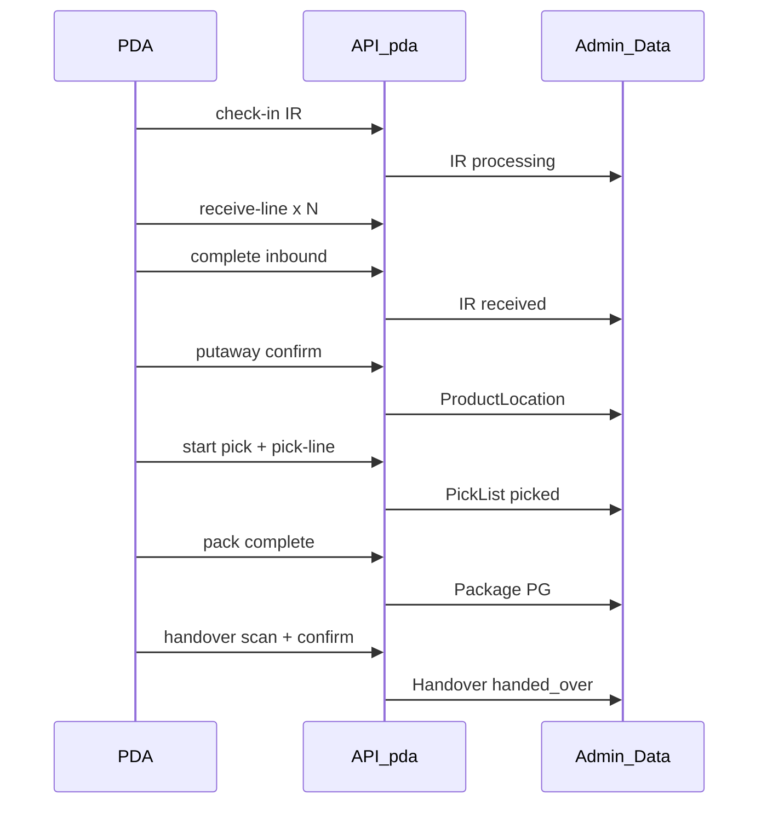

# PDA API Design — `/api/pda/*`

> REST contract cho ứng dụng PDA Phase 1. Mock implementation: [`src/data/pdaApi.ts`](../../src/data/pdaApi.ts).

## 1. Nguyên tắc

| Quy tắc | Mô tả |
|---|---|
| Base URL | `/api/pda` |
| Auth | Bearer JWT từ `POST /auth/login` |
| Context headers | `X-Warehouse-Code`, `X-Pda-Session-Id` (optional) |
| Response envelope | `{ data, error?, meta? }` |
| Idempotency | Header `Idempotency-Key` cho scan confirm (Phase 2) |

## 2. Map entity ↔ Admin data layer

| PDA domain | Admin entity | File |
|---|---|---|
| Inbound | `InboundRequest` | `src/data/inboundRequests.ts` |
| Pick | `PickList` | `src/data/pickingLists.ts` |
| Pack | Tote + Package | `containerDevices`, `productLocations` |
| Handover | `CarrierHandoverSession` | `src/data/carrierHandovers.ts` |
| Inquiry | `ProductLocationRow` | `src/data/productLocations.ts` |

## 3. Auth & Session

### POST `/api/pda/auth/login`

```json
// Request
{ "username": "picker01", "password": "***" }

// Response
{
  "data": {
    "token": "jwt...",
    "user": { "id": "u1", "name": "Nguyễn A", "roleCodes": ["PDA_PICKER"] },
    "permissionKeys": ["pda.auth.login", "pda.pick.execute", ...],
    "warehouses": [{ "code": "KBL", "name": "KBL - Kho Bella Đà Lạt" }]
  }
}
```

### POST `/api/pda/session/start`

```json
{ "warehouseCode": "KBL", "shift": "morning" }
→ { "data": { "sessionId": "pds-...", "warehouseCode": "KBL", "startedAt": "..." } }
```

### GET `/api/pda/session/active`

Trả về phiên receive/pick/pack đang mở của user (để resume).

---

## 4. Inbound

| Method | Path | Map function (mock) | Admin effect |
|---|---|---|---|
| GET | `/inbound/lookup?code=` | `pdaLookupInbound` | — |
| POST | `/inbound/:irId/check-in` | `pdaCheckInInbound` | IR → `processing` |
| GET | `/inbound/sessions/:sessionId` | `pdaGetReceiveSession` | — |
| POST | `/inbound/sessions/:sessionId/receive-line` | `pdaReceiveLine` | `receivedQty++` |
| POST | `/inbound/sessions/:sessionId/complete` | `pdaCompleteInbound` | IR → `received` |

### POST `/inbound/sessions/:sessionId/receive-line`

```json
{
  "sku": "SKU-CHARGER-20W",
  "qty": 10,
  "condition": "new",
  "serials": ["SKU-CHRG-0001", "..."]
}
```

---

## 5. Putaway

| Method | Path | Mock | Admin effect |
|---|---|---|---|
| GET | `/putaway/tasks?warehouse=&status=open` | `pdaListPutawayTasks` | — |
| GET | `/putaway/tasks/:taskId` | `pdaGetPutawayTask` | — |
| POST | `/putaway/tasks/:taskId/confirm` | `pdaConfirmPutaway` | `storedQty++`, ProductLocation |
| POST | `/putaway/tasks/:taskId/complete` | `pdaCompletePutaway` | Task closed |

---

## 6. Pick

| Method | Path | Mock | Admin effect |
|---|---|---|---|
| GET | `/pick/tasks?assignee=me` | `pdaListPickTasks` | — |
| POST | `/pick/tasks/:pickListId/start` | `pdaStartPickSession` | PL → `picking` |
| POST | `/pick/sessions/:sessionId/assign-tote` | `pdaAssignTote` | `pickingDevice` on lines |
| GET | `/pick/sessions/:sessionId/next-line` | `pdaNextPickLine` | Directed sequence |
| POST | `/pick/sessions/:sessionId/pick-line` | `pdaConfirmPickLine` | `pickedQty++` |
| POST | `/pick/sessions/:sessionId/complete` | `pdaCompletePickSession` | PL → `picked` |

### POST `/pick/sessions/:sessionId/pick-line`

```json
{
  "lineId": "pll-1",
  "binCode": "R5.II.T1.001",
  "sku": "SACCOC2",
  "qty": 1
}
```

**Validation:** `binCode === line.location`, `sku === line.sku`.

---

## 7. Pack

| Method | Path | Mock | Admin effect |
|---|---|---|---|
| GET | `/pack/lookup?tote=` | `pdaLookupTote` | — |
| POST | `/pack/sessions/start` | `pdaStartPackSession` | — |
| POST | `/pack/sessions/:sessionId/scan-product` | `pdaScanPackProduct` | — |
| POST | `/pack/sessions/:sessionId/complete` | `pdaCompletePack` | Create package PG... |
| POST | `/pack/sessions/:sessionId/print-label` | `pdaPrintShippingLabel` | trackingCode |

---

## 8. Handover (Bàn giao 3PL)

| Method | Path | Mock | Admin effect |
|---|---|---|---|
| GET | `/handover/sessions?carrier=` | `listCarrierHandovers` filter | — |
| POST | `/handover/sessions` | `createCarrierHandover` | New session (`delivery` \| `receipt`) |
| POST | `/handover/sessions/:id/scan` | `pdaHandoverScan` | Add package (reject OR cancelled) |
| DELETE | `/handover/sessions/:id/packages/:code` | `pdaHandoverRemovePackage` | Remove package |
| POST | `/handover/sessions/:id/confirm` | `pdaConfirmHandover` | → `handed_over` |

UI: `/pda/handover/delivery` · `/pda/handover/receipt`. Reuses `findDemoPackage` + `isOutboundCancelled`.

---

## 9. Inquiry

| Method | Path | Mock |
|---|---|---|
| GET | `/inquiry/scan?value=` | `pdaUniversalScan` |
| GET | `/inquiry/sku/:sku` | `pdaInquiryBySku` |
| GET | `/inquiry/location/:code` | `pdaInquiryByLocation` |
| GET | `/inquiry/package/:code` | `pdaInquiryByPackage` |

---

## 10. Error codes (chuẩn hóa)

| Code | HTTP | Mô tả |
|---|---|---|
| `IR_NOT_FOUND` | 404 | Không tìm thấy IR |
| `IR_INVALID_STATUS` | 409 | Trạng thái IR không cho phép thao tác |
| `SKU_NOT_ON_IR` | 422 | SKU không thuộc IR |
| `BIN_MISMATCH` | 422 | Vị trí quét không khớp directed pick |
| `SKU_MISMATCH` | 422 | SKU không khớp dòng |
| `QTY_EXCEEDS` | 422 | Vượt SL cho phép |
| `PACKAGE_NOT_READY` | 422 | Kiện chưa sẵn sàng bàn giao |
| `PACKAGE_DUPLICATE` | 409 | Kiện đã trong phiên |
| `TOTE_NOT_FOUND` | 404 | Không tìm thấy tote |

---

## 11. Luồng end-to-end (sequence)



---

## 12. Tiêu chí nghiệm thu API

1. Mọi endpoint Phase 1 có mock tương ứng trong `pdaApi.ts`.
2. Validation errors trả đúng `code` + message tiếng Việt.
3. Thao tác PDA phản ánh trên Admin in-memory store (cùng `src/data/*`).
