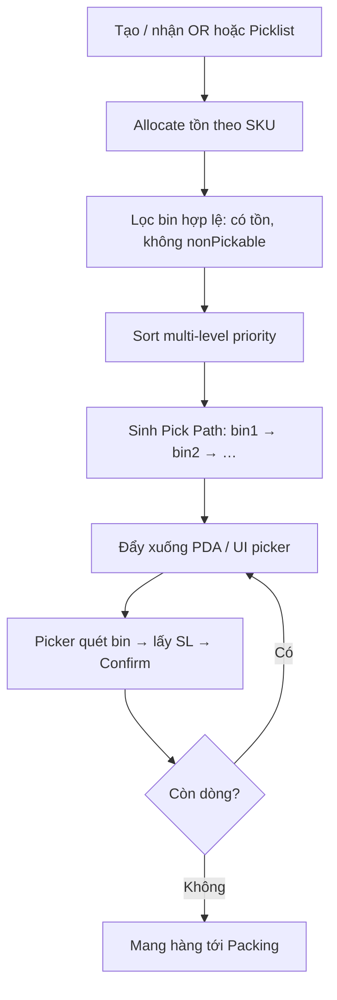

# Nghiệp vụ chi tiết: LỘ TRÌNH PICKER (Pick Path)

> Nguồn: `reference/HDSD Kho.pdf` — Phần 2 mục V (Độ ưu tiên vị trí lấy hàng)  
> **UI vận hành:** **Phân công lấy hàng** → mở từng wave → xem lộ trình của wave đó  
> **UI cấu hình (không phải lộ trình):** Thiết lập → Kho → Thiết lập vị trí (chỉ Room/Aisle/Rack/Level/Bin + priority)  
> Code: `buildPickerPathForWave()` trong `src/data/warehouseLocations.ts` · màn `PickupWaveDetailPage.tsx`

---

## 0. Phân tách trách nhiệm (quan trọng)

| Layer | Nằm ở đâu | Chứa gì |
|-------|-----------|---------|
| **Layout kho** | Thiết lập → Kho → Vị trí | Phòng, tầng, lối, kệ, bin, **độ ưu tiên cố định** |
| **Lộ trình picker** | **Lấy hàng / wave** của nhân viên | Thứ tự bin **của từng yêu cầu**; mỗi wave/OR khác nhau |

**Không** gắn tab “Lộ trình picker” vào màn Kho: lộ trình là **kết quả runtime** sau khi allocate bin cho một pick request, không phải master data.

```text
Cấu hình priority (Kho)  +  Allocate bin theo SKU (wave)  →  Sort  →  Lộ trình của wave đó
```

Hai wave cùng kho có thể đi **hai lộ trình khác nhau** vì tập bin cần lấy khác nhau.

## 1. Lộ trình picker là gì?

**Lộ trình picker** là **thứ tự các bin** mà nhân viên lấy hàng (picker) phải đi qua khi thực hiện **một yêu cầu lấy hàng cụ thể** (wave / picklist / OR).

Hệ thống **không vẽ đường trên bản đồ**, mà **suy ra thứ tự** từ bộ **độ ưu tiên (pick priority)** đã cấu hình trên:

`Phòng → Lối đi → Dãy kệ → Tầng → Bin` (+ cờ Fast Moving / Không lấy hàng)

Mục tiêu:

1. Giảm quãng đường đi bộ / thời gian lấy hàng  
2. Tránh đi vào **góc chết** rồi phải quay lại  
3. Đồng bộ giữa **layout vật lý** và **thứ tự chỉ định trên PDA/UI**

---

## 2. Đầu vào của thuật toán

| Input | Mô tả |
|-------|--------|
| Danh sách nhu cầu lấy | Các dòng pick: SKU + SL (từ OR / picklist) |
| Tồn khả dụng theo bin | Bin nào còn hàng đúng SKU (và lot/serial nếu có) |
| Master vị trí | Room, Aisle, Rack, Level, Bin + `pickPriority` |
| Cờ bin | `nonPickable`, `fastMoving` |

**Loại khỏi ứng viên:**

- Bin `nonPickable = true` (chỉ lưu, không phục vụ đơn)  
- Bin không còn tồn khả dụng cho SKU cần lấy  
- (Tuỳ policy) Bin ngoài kho / ngoài wave / đang khóa kiểm kê  

---

## 3. Quy tắc sắp xếp chuẩn (multi-level sort)

Với mỗi bin ứng viên, hệ thống lấy priority của cha và sort **tăng dần** (số nhỏ = đi trước):

```text
1. Room.pickPriority      ASC
2. Aisle.pickPriority     ASC
3. Rack.pickPriority      ASC
4. Level.pickPriority     ASC
5. Bin.fastMoving         DESC  (true trước false)  — cùng nhóm trên
6. Bin.pickPriority       ASC
```

### 3.1. Vì sao Aisle trước Rack?

Theo HDSD **Dãy kệ**:

- Hai kệ **cùng một lối đi** → so `Rack.priority`  
- Hai kệ **khác lối đi** → ưu tiên **lối có priority cao hơn (số nhỏ hơn)** trước, rồi mới lấy các kệ trong lối đó  

→ Sort Aisle trước Rack thể hiện đúng rule này.

### 3.2. Room & Level

- **Room:** hết hàng phòng ưu tiên 1 rồi mới phòng 2 (VD P1 rồi P2).  
- **Level:** tầng thấp (trệt, priority 1) lấy trước tầng cao — picker không phải lên cao sớm nếu còn hàng dưới.

### 3.3. Fast Moving

Khi hai bin **cùng** room/aisle/rack/level (hoặc đã tie các cấp trên), bin gắn **Fast Moving** được đẩy lên trước trong nhóm — thường đặt gần đầu lối / gần packing.

---

## 4. Ba mẫu lộ trình hiện trường (cấu hình bằng Bin.priority)

Giả sử:

- 2 dãy kệ **A01** và **A02** chung một lối  
- Mỗi dãy 1 tầng **A**, 6 bin: `A.01 … A.06`  
- Ô xanh = bin có hàng cần lấy  
- `Rack.priority` của A01 = A02 (bằng nhau) → **thứ tự đi hoàn toàn do Bin.priority quyết định**

### 4.1. Lối thông 2 phía (double-ended aisle)

**Cấu hình**

| Dãy | Bin vật lý | pickPriority |
|-----|------------|--------------|
| A01 | A.01 → A.06 | 1 → 6 |
| A02 | A.01 → A.06 | 1 → 6 |

**Hành vi:** Picker đi theo index tăng dần trên các bin có nhu cầu (VD cần 2, 3, 5 → đi 2→3→5), rồi ra trạm đóng gói theo phía thuận.

**Khi dùng:** Lối đi mở được cả hai đầu; có thể “lướt” song song hai mặt kệ theo chiều ưu tiên tăng.

```text
[Lối vào] --1--2--3--4--5--6--> [Lối ra phía kia]
A01 / A02 cùng chiều index
```

---

### 4.2. Có góc chết — đi chữ U (recommended khi cuối lối bịt)

**Cấu hình HDSD**

| Dãy | Chiều vật lý | pickPriority |
|-----|--------------|--------------|
| A01 | A.01 → A.06 (vào trong) | **1 → 6** |
| A02 | A.06 → A.01 (quay ra) | **7 → 12** |

Nghĩa là: đi hết một mặt kệ vào đáy lối, **quay U** sang mặt đối diện rồi đi ra ngoài.

**Ví dụ nhu cầu tại index 2, 5, 10**

| Bước | Index | Bin (logic) | Ý nghĩa vật lý |
|------|-------|-------------|----------------|
| 1 | 2 | A01.A.02 | Mặt A01, gần đầu lối |
| 2 | 5 | A01.A.05 | Sâu hơn trên A01 |
| 3 | 10 | A02 (tương ứng priority 10) | Đã quay U sang A02, đang trên đường ra |

Sau bước cuối → mang hàng ra **trạm đóng gói**.

```text
Vào → A01: 1 2 3 4 5 6
                    U
Ra  ← A02: 12 11 10 9 8 7   (priority tăng khi đi ra)
```

**Khi dùng:** Cuối lối là tường / không thông; tránh phải backtrack trên cùng một mặt kệ.

---

### 4.3. Zigzag từ trong ra ngoài

**Cấu hình HDSD**

| Dãy | Chiều vật lý | pickPriority |
|-----|--------------|--------------|
| A01 | A.01 → A.06 | **1 → 6** |
| A02 | A.06 → A.01 | **6 → 1** (đảo, cùng dải số) |

Picker “giao thoa” hai mặt theo index; ví dụ nhu cầu cho thứ tự **2 → 4 → 5**.

**Khi dùng:** Muốn tối ưu xen kẽ hai mặt kệ khi không cần (hoặc không muốn) dải priority nối dài 7–12 như chữ U.

> **Lưu ý implement:** Zigzag dùng dải priority **trùng/overlap** giữa hai kệ → sort thuần `Bin.priority` có thể **không phân biệt được** hai bin cùng số priority trên hai kệ. Cần tie-break thêm: `Rack.code`, `Rack.id`, hoặc quy ước “A01 trước A02 khi priority bằng nhau”. Seed demo chữ U dùng dải **1–12 không trùng** nên sort đơn giản vẫn đúng.

---

## 5. Luồng hệ thống end-to-end



### 5.1. Allocation vs Path

Hai bước tách bạch:

1. **Allocation:** *chọn bin nào* cấp hàng cho dòng đơn (có thể FEFO/LEFO, max SKU, gần packing…).  
2. **Path sequencing:** *sắp thứ tự thăm* các bin đã allocate theo priority hierarchy.

Có thể allocate nhiều dòng vào cùng bin → path chỉ thăm bin đó **một lần** (gom SL).

### 5.2. Tái tính lộ trình

Tính lại khi:

- Đổi cấu hình priority Room/Aisle/Rack/Level/Bin  
- Bin bị SKIP / báo thiếu trên PDA  
- Wave gộp thêm OR  
- Hủy một phần đơn  

---

## 6. Quy tắc nghiệp vụ bổ sung (nên ghi vào AC)

| # | Rule | Hành vi mong muốn |
|---|------|-------------------|
| 1 | Bin `nonPickable` | Không bao giờ xuất hiện trên path đơn xuất |
| 2 | Fast Moving | Chỉ “nhảy” trong phạm vi đã tie các cấp cha; không phá thứ tự Room/Aisle |
| 3 | Đổi priority | Wave đang chạy: giữ path cũ **hoặc** regenerate theo policy kho |
| 4 | Hai bin cùng toàn bộ priority | Tie-break ổn định: `bin.code ASC` |
| 5 | Sau tạo bin | Bắt buộc in tem & dán vật lý trước khi go-live picking |
| 6 | Picker SKIP bin | Tồn có thể điều chỉnh / tạo vấn đề phát sinh; path có thể chỉ định bin thay thế theo cùng thuật toán |

---

## 7. Ví dụ số (demo app)

| Wave | Bin allocate | Lộ trình (sau sort) |
|------|----------------|---------------------|
| `WAVE-20260720-01` | A.02, A.05, A02.A.03 | **2 → 5 → 10** (chữ U) |
| `WAVE-20260720-02` | A.01, A.04, A02.A.06 | **1 → 4 → 7** (khác wave 01) |
| `WAVE-20260719-08` (HN) | (trống) | Không có lộ trình — kho chưa layout / chưa allocate |

UI: **Phân công lấy hàng** → click wave / nút **Lộ trình**.

---

## 8. Checklist task cho Dev

- [ ] Master priority chỉ ở màn Kho (không hiển thị “lộ trình” tại đây)  
- [ ] API allocate bin theo SKU cho wave/OR  
- [ ] Service `buildPickPath(waveId)` sort multi-level trên **tập bin của wave**  
- [ ] UI/PDA lấy hàng: mỗi yêu cầu một path riêng  
- [ ] Đổi priority layout → wave mới / regenerate theo policy  
- [ ] Test: 2 wave cùng kho, path khác nhau  

---

## 9. Một câu tóm tắt

> **Layout kho** cố định độ ưu tiên vị trí; **lộ trình picker** là thứ tự thăm bin **của từng yêu cầu lấy hàng**, tính lúc vận hành sau allocate — cùng kho nhưng khác wave thì lộ trình khác.
